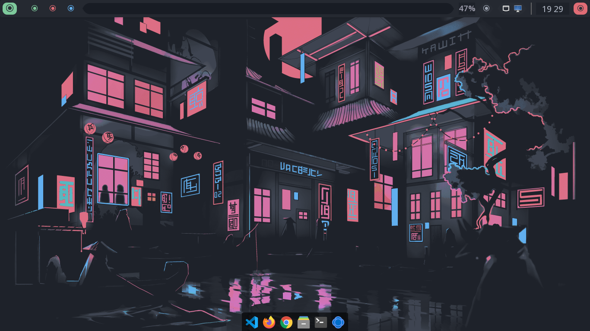
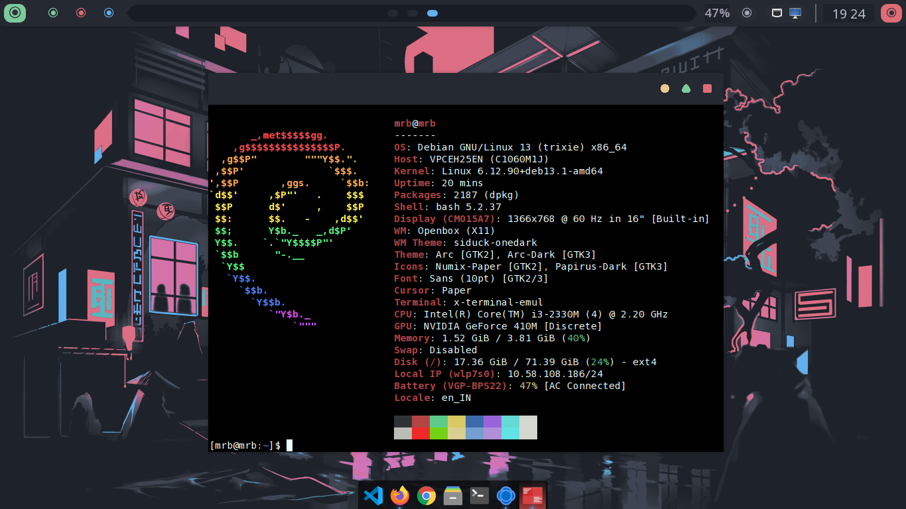
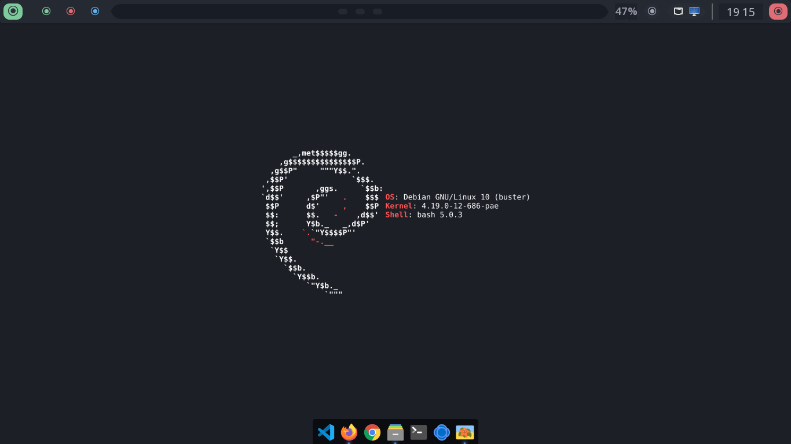

# README.md

  

<h1 align="center">MrbCraft</h1>

  A highly professional, minimal Linux distribution, based on <b>Debian Linux</b>.

  
  
  
  

  
  
  

  
  
  

---

MrbCraft is a beautifully crafted Linux distribution based on Debian. Built with a pre-configured Openbox window manager and sleek desktop aesthetics, it provides a stunning, developer-focused out-of-the-box experience.

It comes pre-configured with various lightweight applications which makes it super fast and highly responsive. Engineered with a specialized skeleton structure, it provides a secure, clean, and zero-bloat environment perfect for modern coding workflows.

### Key Features
* **Rock-Solid Base:** Powered by Debian's stable core framework.
* **Stunning Openbox:** Pre-configured window manager with zero-bloat.
* **Modern Panels:** Beautiful configuration with Plank and Polybar docks.
* **Clean Display:** Includes the customized Desert-SDDM login manager.
* 
